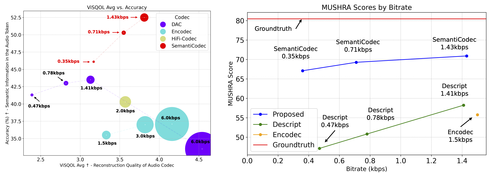

[](https://arxiv.org/abs/2405.00233)  [](https://haoheliu.github.io/SemantiCodec/) 

# SemantiCodec
Ultra-low bitrate neural audio codec with a better semantic in the latent space.

**Highlight**
- Bitrate: 0.31 kbps - 1.40 kbps
- Token rate: 25, 50, or 100 per second
- cpu, cuda, and mps are supported

# Usage

## Installation

```bash
pip install git+https://github.com/haoheliu/SemantiCodec-inference.git
```

## Encoding and decoding

```python
from semanticodec import SemantiCodec

semanticodec = SemantiCodec(token_rate=50, semantic_vocab_size=16384) # 0.68 kbps

filepath = "test/test.wav" # for example 10 seconds

tokens = semanticodec.encode(filepath) # tokens: torch.Size([1, 250, 2])
waveform = semanticodec.decode(tokens)

# Save the reconstruction file
import soundfile as sf
sf.write("output.wav", waveform[0,0], 16000)
```

## Other Settings

```python
from semanticodec import SemantiCodec

###############Choose one of the following######################
semanticodec = SemantiCodec(token_rate=100, semantic_vocab_size=32768) # 1.40 kbps
semanticodec = SemantiCodec(token_rate=50, semantic_vocab_size=32768) # 0.70 kbps
semanticodec = SemantiCodec(token_rate=25, semantic_vocab_size=32768) # 0.35 kbps

semanticodec = SemantiCodec(token_rate=100, semantic_vocab_size=16384) # 1.35 kbps
semanticodec = SemantiCodec(token_rate=50, semantic_vocab_size=16384) # 0.68 kbps
semanticodec = SemantiCodec(token_rate=25, semantic_vocab_size=16384) # 0.34 kbps

semanticodec = SemantiCodec(token_rate=100, semantic_vocab_size=8192) # 1.30 kbps
semanticodec = SemantiCodec(token_rate=50, semantic_vocab_size=8192) # 0.65 kbps
semanticodec = SemantiCodec(token_rate=25, semantic_vocab_size=8192) # 0.33 kbps

semanticodec = SemantiCodec(token_rate=100, semantic_vocab_size=4096) # 1.25 kbps
semanticodec = SemantiCodec(token_rate=50, semantic_vocab_size=4096) # 0.63 kbps
semanticodec = SemantiCodec(token_rate=25, semantic_vocab_size=4096) # 0.31 kbps
#####################################

filepath = "test/test.wav"

tokens = semanticodec.encode(filepath)
waveform = semanticodec.decode(tokens)

import soundfile as sf
sf.write("output.wav", waveform[0,0], 16000)
```

If you are interested in reusing the same evaluation pipeline and data in the paper, please refer to this [zenodo repo](https://zenodo.org/records/11047204).

## Citation
If you find this repo helpful, please consider citing in the following format:

```bibtex
@article{liu2024semanticodec,
  title={SemantiCodec: An Ultra Low Bitrate Semantic Audio Codec for General Sound},
  author={Liu, Haohe and Xu, Xuenan and Yuan, Yi and Wu, Mengyue and Wang, Wenwu and Plumbley, Mark D},
  journal={arXiv preprint arXiv:2405.00233},
  year={2024}
}
```



